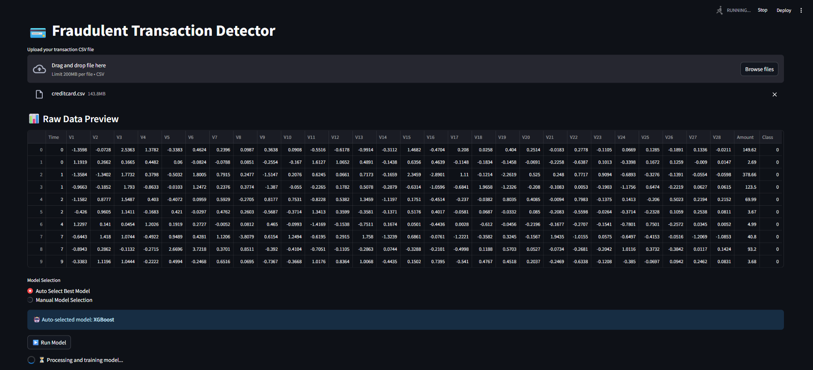

# 💳 Fraudulent Transaction Detector

A Streamlit-powered web app that automatically detects fraudulent transactions using machine learning models such as XGBoost, Random Forest, and Logistic Regression. It supports both auto and manual model selection modes.

## 🚀 Features

- Upload your own CSV transaction file
- Auto or manual model selection
- Handles imbalanced data using SMOTEENN
- Performance metrics (Precision, Recall, F1-Score)
- Confusion Matrix & ROC Curve
- Download fraud predictions as CSV
- Smart model recommendation based on data characteristics

## 📂 Dataset Format

The uploaded CSV file **must** contain:
- A `Class` column (`0 = legit`, `1 = fraud`)
- A numerical `Amount` column
- Optional `Time` column (it will be removed)

This project uses the [Credit Card Fraud Detection Dataset](https://www.kaggle.com/datasets/mlg-ulb/creditcardfraud), originally provided by researchers at ULB (Université Libre de Bruxelles). The dataset contains credit card transactions made by European cardholders in September 2013.
### 🧾 Features:

- **Time**: Seconds elapsed between this transaction and the first transaction in the dataset.
- **V1 to V28**: Principal components obtained using PCA to ensure confidentiality of the data.
- **Amount**: The transaction amount.
- **Class**: Target label (`1` for fraud, `0` for non-fraud).

> ℹ️ This dataset is highly imbalanced, which closely resembles real-world scenarios where fraudulent transactions are rare.


## 🧠 Models Used

- **XGBoost**: For large/imbalanced datasets
- **Random Forest**: Balanced accuracy, handles noise
- **Logistic Regression**: For simpler data with few features

## 📊 Metrics Visualized

- Classification Report
- Confusion Matrix
- ROC Curve (AUC Score)
- Fraudulent transaction preview

## 🔧 Tech Stack

- **Frontend**: Streamlit
- **Backend/ML**: Scikit-learn, XGBoost, Imbalanced-learn
- **Visualization**: Seaborn, Matplotlib
- **Resampling**: SMOTEENN

Here is a preview of the Fraudulent Transaction Detector app in action:

### Data Upload Screen  


### Model Training & Results  
📄 [Model Results (PDF)](images/sample.pdf)


## ▶️ How to Run


```bash
# 1. Clone this repo
git clone https://github.com/Dharnu04/fraud-detector-app.git
cd fraud-detector-app

# 2. Install dependencies
pip install -r requirements.txt

# 3. Launch the app
streamlit run app.py
